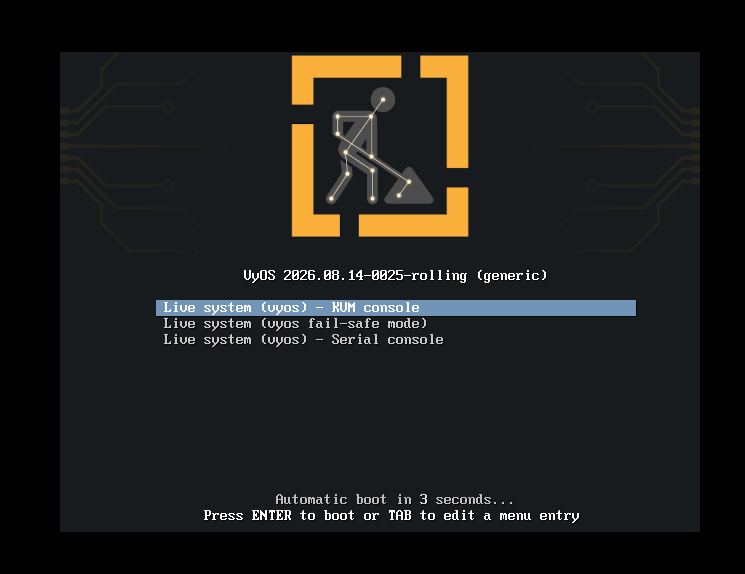
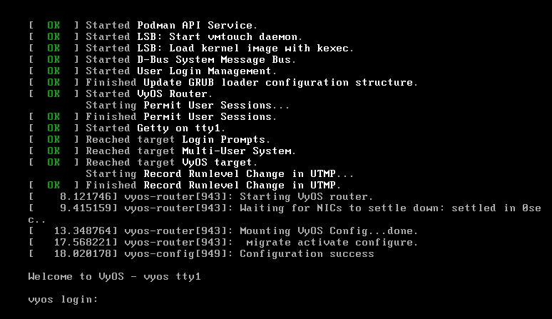
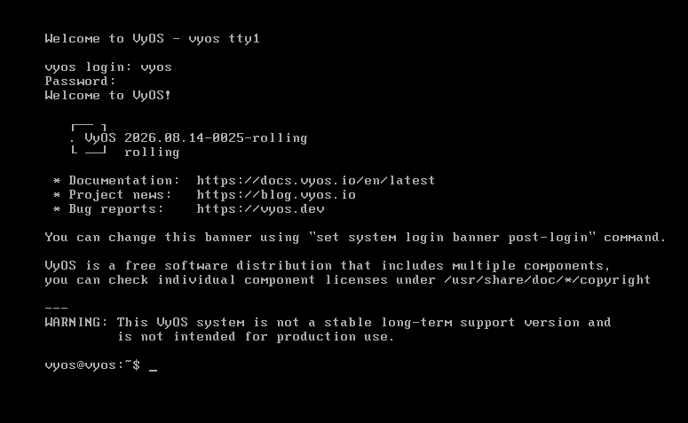
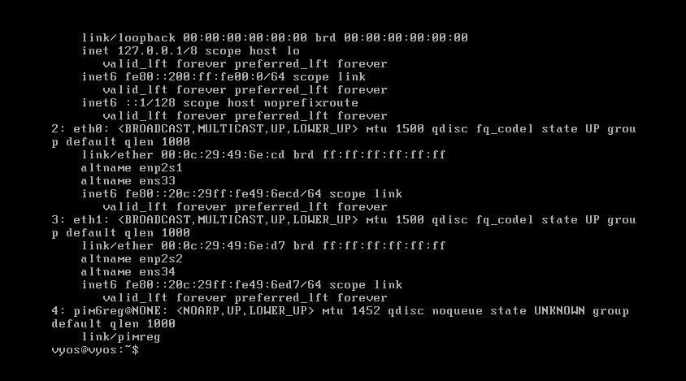
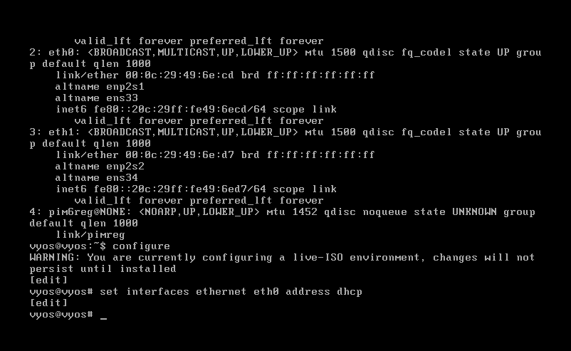
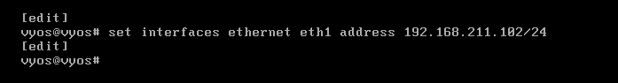
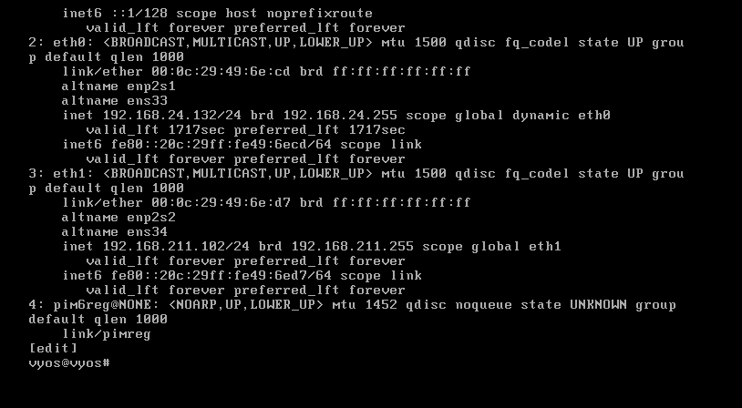
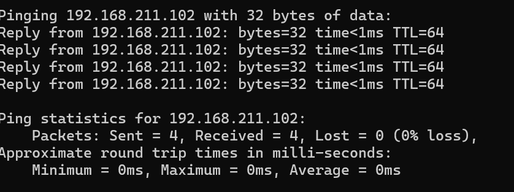
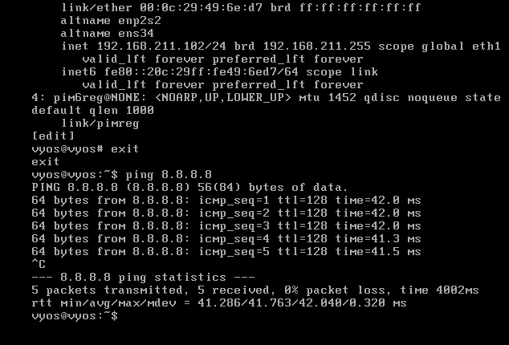

# This Documentation Created By Kanan_H

## Steps to install pfSense, OPNsense, and VyOS

First, we need to download all of them.

For pfSense, we will use the Internet Archive site. The link is provided below. I downloaded 2.6.0 for stability and ease of use. Click ISO and start the download.

Here is the link: https://archive.org/details/pfSense-CE-2.6.0-RELEASE-amd64

---

After that, we have to download OPNsense. Go to this site: https://opnsense.org/download/

Choose the image type DVD and click download. The download will start automatically. It will download an archive file. After the download, right-click it and extract it so you will find the ISO there.

---

Last, we need to download VyOS. Go to VyOS GitHub: https://github.com/vyos/vyos-nightly-build/releases

Choose the latest version and click it. In our case, it's 2026.08.14-0025-rolling. Click on it.

Then scroll down to the end and find assets. In assets, there is a filename called `vyos-2026.08.14-0025-rolling-generic-amd64.iso`. Click on it and the download will start automatically.

Now we have downloaded all the required ISO files. Now let's install them into virtual machines. I will use VMware for this.

---

## First, let's install pfSense

Open your VMware. You will see a home screen like in the picture:

Click Create New Virtual Machine, then click Custom (Advanced).

Click next and do not change anything on the next page, then click next again. Select I will install the operating system later and click next.

In the next window, choose Linux and Debian 12.x 64-bit.

Give a name to your machine and click next. I named it pfSense.

Set the CPU settings like in the picture below, then click next:

Assign 2 GB of RAM on this page and click next:

In the current section, select NAT for now and click next.

In the next page, select Recommended and click next, and choose Recommended again and click next.

In the current section, select Create a New Virtual Disk and click next.

Set the size to 20 GB and select Single Virtual Disk.

Click next on the next page and then click finish. If there is any checkbox that says Power On this VM, uncheck it. We will make adjustments before starting the VM.

Your virtual machine will appear on the left panel. Right-click it, then go to Manage and click Settings. This panel will appear:

Click add and choose Network Adapter, then click finish:

Click the newly added network adapter and, in the right pane, select Host-only:

Now click CD/DVD and select the ISO file that you downloaded. Click OK to close the settings tab and click pfSense, then select Start the VM.

---

## Now let's install and configure pfSense

After launching, wait a little bit and the install page will appear:

Choose Install and press OK:

Select Continue with default keymap and press Select:

Select Auto (ZFS) and press OK:

Select Install and press Select:

Choose Stripe and press OK:

Press the spacebar to select the disk and press OK:

Click Yes to erase the disk:

Wait for the installation to complete. After the installation is completed, select No and then reboot it:

Wait for it to start and you will see the main panel:

You will see two IP addresses, one for WAN and one for LAN. We will access the admin panel via an IP address, so we have to configure it in order to reach it from Windows.

Choose 2 from the list and press Enter:

Select 2:

Enter the desired IP address that is situated in the same subnet. To know your machine's IP, go to Windows and type `ipconfig`.

You will see the VMware Host-only or VMnet1 IP and subnet. In this case, my subnet is 211, so I will set an IP with the same subnet.

Set the subnet count to 24 and press Enter:

Press Enter for none:

We are not setting an IPv6 right now, so leave it as none and press Enter. Type Y and press Enter. Type the IP start range and end range according to the IP you set. Then type N and press Enter because we will use HTTPS.

Now you can access the admin panel via the provided IP address on your screen, not the one shown here.

Default credentials are admin, pfsense. After that, you will be prompted to complete the configuration. That's all for now.

---

## Now let's install OPNsense

The configuration will be the same as pfSense. Just repeat all the steps for the configuration in VMware.

Let's install OPNsense now:

OPNsense installation is a bit different from pfSense. After you start the machine, this screen will appear:

What you see is live mode without installation, so we need to install it. For this, type installer in the login field and type opnsense in the password field, then press Enter. The install screen will appear.

Select Continue with default keymap and press next:

Select Install (ZFS):

If it asks for more than 2 GB of RAM, click Proceed Anyway:

Select Stripe:

Press the spacebar to choose the disk, then press Enter:

Click Yes to erase the disk and start the installation:

Wait for the installation to complete as with pfSense:

After the installation is complete, keep or change the password if you want, then reboot and wait for it to start. Then log in with root and the OPNsense password:

Now, as in pfSense, we have two interfaces there and we have to configure the LAN one. Type 2, then choose LAN (enter LAN number):

Type Yes if you want a dynamic IP and type N if you want a static IP. I chose a static one:

Enter the desired IP address as in pfSense, but use the same subnet as the Host-only adapter:

Type 24 as in pfSense:

Choose what I chose for the following questions, as provided in the picture:

Choose N for certificates and N for HTTP requests. After that, the setup is complete and you can access the interface via the web. Default credentials are root and opnsense:

---

## Last, let's install VyOS

The configuration will be the same as pfSense. Just repeat all the steps for the configuration in VMware.

Let's install VyOS now:

Launch the machine and you will see a menu. Choose the first one:

After starting, you will be prompted to the login screen. The login is vyos and the password is vyos. Use these to log in to the system:

After logging in, this will appear:

Type `ip addr` so we will know our interfaces to configure later:

Now we have to go into configuration mode to configure the interfaces. Type `configure` in the command line.

After that, write this to configure the eth0 interface via DHCP:

`set interfaces ethernet eth0 address dhcp`

Now we use the Host-only adapter IP address and subnet to configure the LAN interface. For that, I typed:

`set interfaces ethernet eth1 address 192.168.211.102/24`

because my IP is this.

Now we have to apply the configuration, so type `commit` and press Enter. This will apply the configuration. Type `save` to save the settings. Now our interfaces are set:

Now type `exit` to go back to normal mode. Now it's time to test the connection. Go to CMD and write:

`ping 192.168.211.102`

and look for replies.

Now let's test whether VyOS can reach the internet. In VyOS, type:

`ping 8.8.8.8`

and look for replies:

Installation completed. That's all for now.
