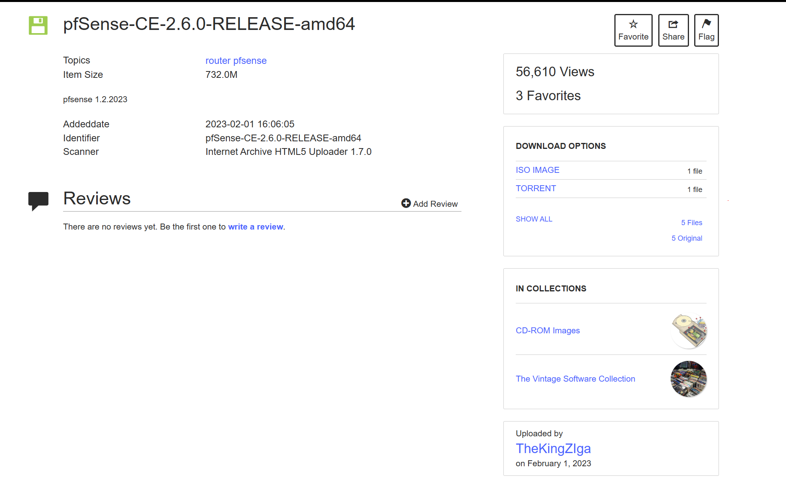

# Steps to install pfsense, opensense adn VyOs

First we need to download all of them.

For pfsense we will use Internet Archive site. Link is provided below. I downloaded 2.6.0 for stability and ease of use. Click ISO and start download.

Here is the link: [https://archive.org/details/pfSense-CE-2.6.0-RELEASE-amd64](https://archive.org/details/pfSense-CE-2.6.0-RELEASE-amd64)

---

After that we have to download Opensense. Go to this site: [https://opnsense.org/download/](https://opnsense.org/download/)

Choose image type DVD and click download. The download will start automatically. It will download archive file after download right click and extract it so you will find iso there.

---

Last we need download VyOS. Go to VyOS Github : [https://github.com/vyos/vyos-nightly-build/releases](https://github.com/vyos/vyos-nightly-build/releases)

Choose the latest version and click it. in our case its 2026.08.14-0025-rolling. Click on it.

**screenshot vyos 1**

Then scroll down to end and find asstes and in asstes there filename called `vyos-2026.08.14-0025-rolling-generic-amd64.iso`. Click on it and download will start automatically.

**Screenshot vyos 2**

Now we downloaded all the required iso files now lets install them into Virual machine i will use VmWare for this.

---

## First lets install PfSense

Open your VmWare you will see home screen like in picture:

**vmware picture**

Click Create new virtual machine then click custom(advanced).

**vmware2 pic**

Click next and do not change anything in next page and clik next again. Seleck i will install operating system later and click next.

**wmware3**

In the next window choose linux and Debian 12.x 64 Bit.

**wmware4**

Give name to you machine and click next. I named as PfSense.

**wmware5**

Set the cpu setting like in the picture below then click next:

**wmware 6**

Assign 2Gb Of ram in this page and click next:

**wmawre7**

In current section select NAT for now and click next.

**wmware8**

In next page select Recommend and click next and choose recommend again and click next.

In current section select create new virtual disk and click next.

**wmware9**

Size 20gb And select single Virtual disk.

**wmware10**

Click next on next page and then click finish if there any checkbox that says Power On this vm uncheck it we will make adjustments before start the vm.

Your Virtual machine will appear on the left panel. Right click it then go to manage then click settings. This panel will appear:

**wmware11**

Clcik add and chhose network adapter and click finish:

**wmware12**

Click new added network adapter and in the right pane select host only:

**wmware13**

Now click cd/dvd and select iso file that you downloaded and clikk ok to close the settongs tab and click the PfSense and select star the VM.

---

## Now lets install and configure PfSense

Afer launch wait a little bit and the install page will appear:

**pfsense1**

Choose insall and press ok:

**pfsense2**

Select Continue with default keymap and press select:

**pfsense3**

Select Auto(ZFS) and press OK:

**PFSENSE4**

Select install and press Select:

**pfsense5**

Choose stripe and press ok:

**pfsense6**

Press spacebar to select disk and press ok:

**pfsense7**

Cliick yes to erase the disk:

**pfsense8**

Wait for install complete:

**pfsense9**

After the install completed select no then reboot it:

**pfsense9**

Wait for the start and you will see main panel:

**pfsense10**

You will see two ip adress one for wan one for lan. We will acees the admin panel via an adress so we have to configre it in order to reach t from windows.

Choose 2 from the list and enter:

**pfsense11**

Select 2:

**pfsense12**

Enter the desired ip adrees that situates in same subnet to know your machine ip go windows and type ipconfig.

you will see vmware host only or vmnet1 ip and subnet. In this case my subnet is 211 so I will set an ip with subnet zero.

**pfsense13**

Set subnet count to 24 press enter:

**pfsense14**

Prees enter for none:

**pfsense15**

We are not setting an ipv6 right now so leave it none and press enter. Type y and press enter:

**pfsense16**

Type ip start range and end range according the ip you set. Then type n and press enter cause we will use https.

**pfsense17**

Now you can access the internet via provided ip address on the screen of yours not this but what you appeared on your screen.

**pfsense18**

Default creds are admin , pfsense. After then you will promote to configuration. Thats all for now.

**pfsense18**
